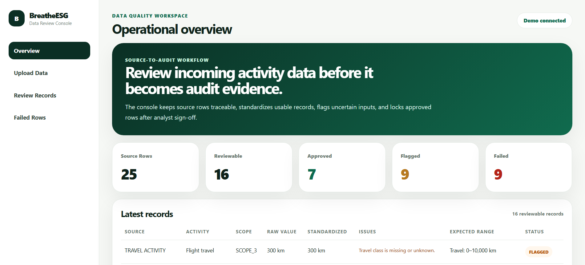
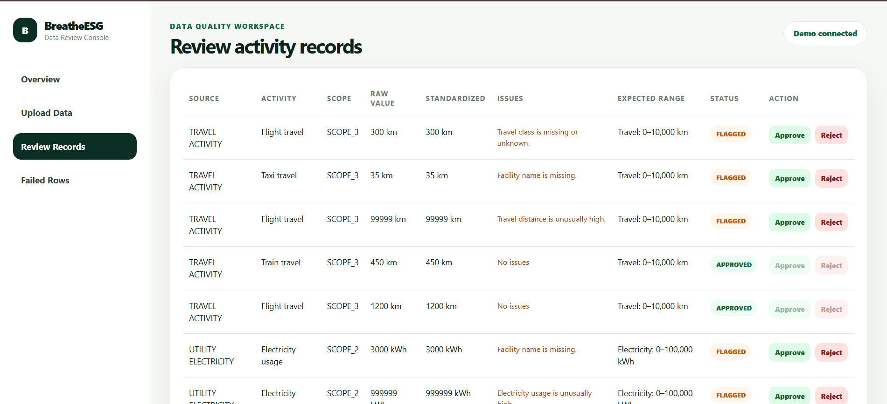
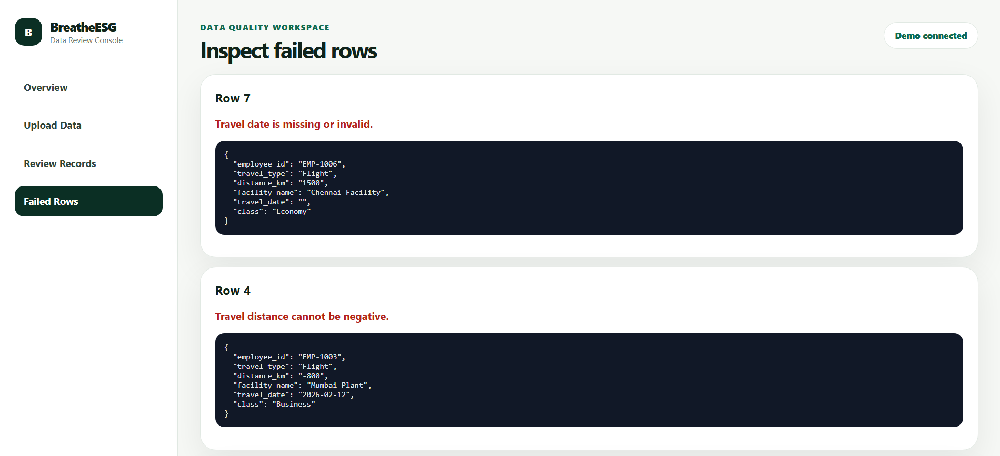
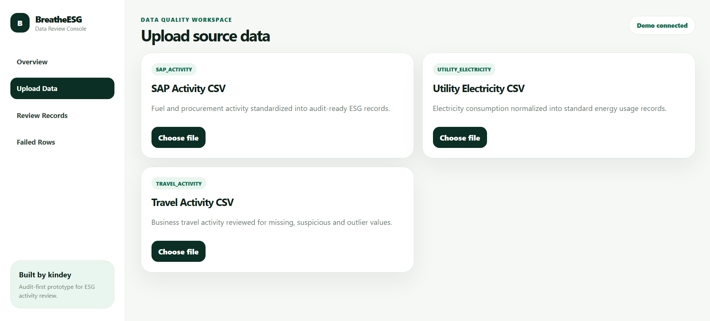

# BreatheESG — From messy CSVs to audit-ready ESG records

Most ESG dashboards look clean.

The data behind them usually isn't.

This project focuses on the messy middle layer:
taking raw operational exports from systems like SAP, utility portals and travel platforms, standardizing them into reviewable ESG activity records, and building an analyst workflow before the data becomes audit evidence.

Instead of treating ingestion as a simple upload problem, I treated it as an operational review problem.

<br>

## 🌍 Live Demo

| Service | Link |
|:--|:--|
| Frontend | https://breathe-esg-review.vercel.app |
| Backend API | https://breathe-esg-review-6gh7.onrender.com/api/ingestion/dashboard/ |

<br>

# What this prototype tries to solve

Enterprise ESG reporting usually starts with:
- inconsistent exports
- missing metadata
- broken units
- suspicious operational values
- fragmented source systems

This prototype simulates that ingestion layer before ESG data becomes audit-ready.

The workflow focuses on:
- ingestion traceability
- standardization
- validation
- suspicious row detection
- analyst review
- audit-style approval flow

<br>

# What the system actually does

| Capability | Description |
|:--|:--|
| Multi-source ingestion | Upload ESG CSV exports from different operational systems |
| Standardization | Normalize inconsistent units into comparable activity data |
| Validation | Detect missing fields, invalid units and suspicious values |
| Review workflow | Route suspicious records to analyst review |
| Failed ingestion queue | Separate invalid rows from operational review |
| Audit-style approvals | Lock approved records after review |

<br>

# Supported upload types

| Dataset | Examples |
|:--|:--|
| SAP Activity | Fuel usage, procurement activity |
| Utility Electricity | Electricity consumption exports |
| Travel Activity | Flight, train, taxi travel exports |

<br>

# Why I built it this way

While researching ESG reporting workflows, one thing became obvious very quickly:

the difficult part usually isn’t the dashboard.

It’s the operational data before the dashboard.

Different systems export:
- inconsistent units
- missing metadata
- unusual naming conventions
- suspicious operational values

So instead of building a reporting UI first, I focused the prototype around:
- ingestion traceability
- normalization
- suspicious row detection
- analyst review
- audit-style approval flow

<br>

# How data moves through the system

```text
Upload CSV
   ↓
Parse source rows
   ↓
Validate records
   ↓
Normalize units & quantities
   ↓
Detect suspicious values
   ↓
Move invalid rows to failed queue
   ↓
Send flagged rows for analyst review
   ↓
Approve / Reject
```

<br>

# Example standardization

| Raw Input | Standardized Output |
|:--|:--|
| 20 US_GAL petrol | 75.708 L |
| 3 MWh electricity | 3000 kWh |
| Travel exports | standardized km values |

<br>

# Example ingestion issues detected

| Input Problem | What the system does |
|:--|:--|
| Missing facility name | Flags for analyst review |
| Extremely large fuel quantity | Marks as suspicious |
| Unsupported unit | Moves to failed rows |
| Missing quantity | Rejects ingestion row |
| Invalid numeric values | Prevents normalization |

<br>

# Dashboard workflow

| Status | Meaning |
|:--|:--|
| APPROVED | Clean operational record |
| FLAGGED | Requires analyst review |
| FAILED | Invalid ingestion row |
| REJECTED | Manually rejected by reviewer |

<br>

# Screenshots

## Operational Overview



<br>

## Review Records



<br>

## Failed Rows



<br>

## Upload Workflow



<br>

# Stack

| Layer | Technology |
|:--|:--|
| Frontend | React + Vite |
| Backend | Django + Django REST Framework |
| Database | SQLite |
| Deployment | Vercel + Render |

<br>

# Local setup

## Clone repository

```bash
git clone https://github.com/kindey10/Breathe_Esg_review.git

cd Breathe_Esg_review
```

<br>

## Backend setup

```bash
cd backend

python -m venv venv

venv\Scripts\activate

pip install -r requirements.txt

python manage.py migrate

python manage.py seed_demo

python manage.py runserver
```

Backend:
```text
http://127.0.0.1:8000
```

<br>

## Frontend setup

```bash
cd frontend

npm install

npm run dev
```

Frontend:
```text
http://localhost:5173
```

<br>

# Demo credentials

```text
Username: kindey
Password: Demo@12345
```

<br>

# Additional documentation

| File | Purpose |
|:--|:--|
| MODEL.md | Data modeling and architecture decisions |
| DECISIONS.md | Ambiguities and implementation decisions |
| TRADEOFFS.md | Intentional shortcuts and scope choices |
| SOURCES.md | Research behind fabricated source data |

<br>

# A few implementation notes

- Demo datasets are auto-seeded
- Suspicious records intentionally require review
- Failed ingestion rows are separated from operational records
- Clean records are auto-approved
- Backend is hosted on Render free tier and may take ~30 seconds to wake on first request

<br>

# Device support

This project is currently optimized for:
- laptops
- desktop browsers

The UI is intentionally designed like an internal operational review console rather than a mobile-first consumer product.

<br>

# What I would add next

If this evolved beyond the assignment prototype, I would likely add:
- reviewer comments
- audit timeline history
- async ingestion workers
- emissions calculation engine
- PostgreSQL
- bulk approval actions
- object storage for uploaded files
- advanced analytics

<br>

# Author

Kinjal Pandey

GitHub:
https://github.com/kindey10